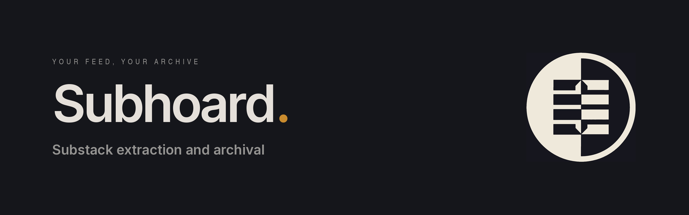

**Subhoard** archives a Substack publication to your email mailbox, a set of yearly Markdown digests, or PDFs — including subscriber-only posts you're paying for.

---

## Features

- **Email mode** — sends each post as a clean HTML email via any SMTP provider (Mailgun, SendGrid, Gmail, etc.), so your archive lives in your inbox
- **Digest mode** — writes one Markdown file per year, ready to upload to [NotebookLM](https://notebooklm.google.com/) or any other tool
- **PDF mode** — writes one formatted PDF per year
- **Free-only mode** — no cookies needed; uses Camoufox to bypass bot detection on the Substack API
- **Paid content support** — fetches subscriber-only posts using cookies exported from your browser
- **Resumable** — caches content and email-delivery state; interrupted runs continue without losing failed sends
- **Date filtering** — optionally process only posts on or after a given date

## Requirements

- Python 3.9+
- A Substack subscription to the publication (for paid content)

## Installation

Clone the repo:

```bash
git clone https://github.com/pabooth/subhoard.git
pip install -r requirements.txt
python3 -m camoufox fetch
```

Or download the python file:

```bash
curl -O https://raw.githubusercontent.com/pabooth//main/subhoard.py
pip install camoufox[geoip] beautifulsoup4 reportlab
python3 -m camoufox fetch   # one-off browser download, ~100 MB
```

## Configuration

Open `subhoard.py` and fill in the `CONFIG` section near the top of the file.

### Required

```python
SUBSTACK_URL = "https://PUBLICATION.COM" (usually, but not always https://PUBLICATION.substack.com)
```

### Free vs paid content

```python
FREE_ONLY = True   # no cookies needed — skips paid posts
FREE_ONLY = False  # fetches everything, requires cookies.txt
```

To get `cookies.txt` for paid content:

1. Install the [Get cookies.txt LOCALLY](https://chrome.google.com/webstore/detail/get-cookiestxt-locally/cclelndahbckbenkjhflpdbgdldlbecc) browser extension
2. Log into **substack.com** (not the publication's own domain)
3. Click the extension icon and export — save the file as `cookies.txt` in the same directory as the script

### Output mode

```python
OUTPUT_MODE = "email"                          # single mode
OUTPUT_MODE = ["pdf", "digest"]            # multiple modes in one run
OUTPUT_MODE = ["email", "pdf", "digest"]
```

### Email settings (required for `email` mode)

```python
SMTP_HOST     = "MAILSERVER"
SMTP_PORT     = PORT_NUMBER
SMTP_USERNAME = "YOUR_SMTP_USERNAME"
SMTP_PASSWORD = "YOUR_SMTP_PASSWORD"
FROM_ADDRESS  = "Publication Name <noreply@yourdomain.com>"
TO_ADDRESS    = "Your Name <you@example.com>"
```

Any SMTP provider works. With Gmail, use an [App Password](https://support.google.com/accounts/answer/185833) and `smtp.gmail.com` on port 587. However, you'll be limited to the sending address depending on the server you use.

### Optional settings

| Setting | Default | Description |
|---|---|---|
| `START_DATE` | `None` | Only process posts on or after this date (`"YYYY-MM-DD"`) |
| `FETCH_DELAY` | `0` | Seconds to wait between post fetches |
| `EMAIL_DELAY` | `0` | Seconds to wait between emails |
| `DRY_RUN` | `False` | List posts without producing any output |
| `LOG_FILE` | `None` | Write output to a log file instead of stdout |
| `CACHE_DIR` | `"post_cache"` | Directory for the fetch cache; set to `None` to disable |
| `DIGEST_OUTPUT_DIR` | `"digest_export"` | Output directory for digest mode |
| `PDF_OUTPUT_DIR` | `"pdf_export"` | Output directory for PDF mode |

## Usage

```bash
python3 subhoard.py
```

Run with `DRY_RUN = True` first to confirm the post list before fetching content.

## Development

The regression suite uses Python's standard library:

```bash
python3 -m unittest discover -s tests -v
```

## License

MIT — see [LICENSE](./LICENSE).
